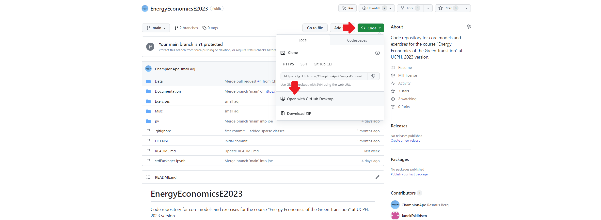
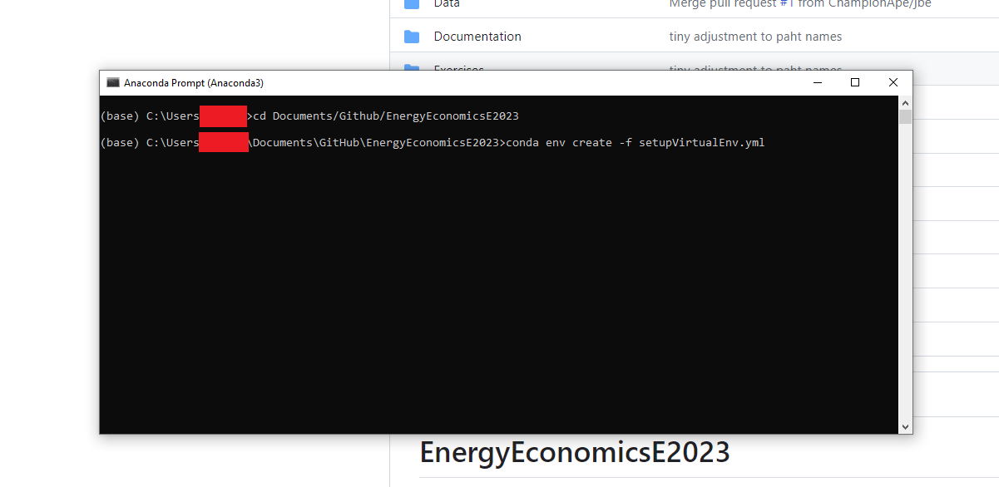

# EnergyEconomicsE2023
Code repository for core models and exercises for the course "Energy Economics of the Green Transition" at UCPH, 2023 version.

## Updated Installation guide (12-09-2023):
There has been more technical issues with the installation guide than anticipated. So, if you still do not have a working installation, the following is a simplified installation guide:
* Install Anaconda distribution of Python (default settings).
* Install Github Desktop.
* Navigate to the course repository, ```Code``` tab and then ```Open with Github Desktop```. 
  
* Open "Anaconda Prompt" ("Terminal for Mac) and navigate to the folder where you've cloned the repo using the ```cd``` command.
* Install virtual environment writing: ```conda env create -f setupVirtualEnv.yml``` (You have to press ```y+enter``` to proceed afterwards).
  

### Opening/runnning exercises
The steps above installs what is called a virtual environment on your computer called ```EE2023```; this is a specific copy of your Python installation that has specific versions of relevant packages installed. Now, everytime you work in this course, you do the following:
* Open Anaconda Prompt (or Terminal for Mac) and add ```conda activate EE2023```. Then, you can open e.g. the Jupyter Lab that exercises are written in by calling  ```jupyter lab```. *Note: You have to keep this prompt/terminal open as long as you work in your notebook.*
  

## Installation guide (Old)
The models require installation of Python (e.g. through Anaconda), some type of git tool (e.g. Github Desktop, Git, Tortoise), and an editor for python code (e.g. VSCode or Sublime). The course *Introduction to Programming and Numerical Analysis* provides some pretty detailed guides for setting up Python and VSCode: https://numeconcopenhagen.netlify.app/guides/. We do, however, rely on different packages in this course, so you will need to supplement the installation with a few extra steps.

#### Requirements (after installation):
* Open "Anaconda Prompt" ("Terminal" for Mac) and write: ```conda install jupyterlab nodejs pandas openpyxl scipy```.
* Also from "Anaconda Prompt" ("Terminal" for Mac): ```pip install seaborn pyDbs```.

If you already have some of these packages installed, you might need to update them. In particular, you'll need:
 * pandas version >=1.5.1 
 * scipy version >=1.10.0
If you have existing projects that may require older versions of these packages, you should instead create a virtual environment with the new versions. 
